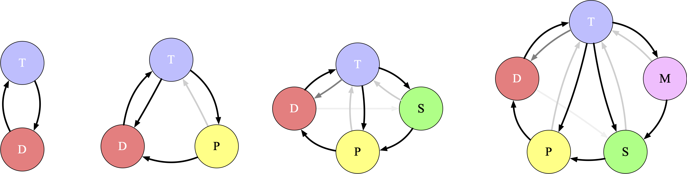
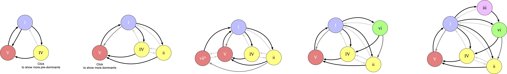
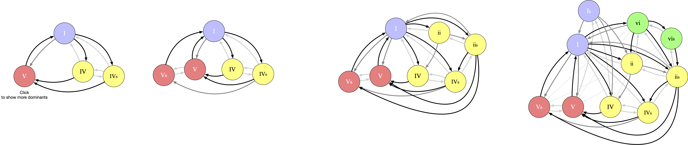

# GENED 1080 Proposal: Harmonic Pathfinder

I propose here to develop an interactive audio-visual tool which allows a student to incrementally build sequences of chords whose characteristcs resemble those of the Western Common Practice Period. This work piggybacks off of the [chord-sequence-chooser](https://github.com/bwetherfield), created by ES-25 TF Ben Wetherfield in the Fall of 2018.

The goal for this project is to offer the students a way into understanding the relationships between the harmonies that are inescapable in the sonic landscape of Harvard in 2019.

## Basic Overview

This tool presents a [graph](https://en.wikipedia.org/wiki/Graph_theory)1 representation of harmonic functions and the movement amongst them. Each node represents an instance of a harmonic function (e.g., `I`, `ii6`, `V7`, etc.) and each edge represents the probability of moving from one to another (e.g., `V -> I` will be very likely while `V -> IV` will be non-existent).

This graph representation is equivalent to a first-order Markov chain, and can be configured either by the tastes of those-in-charge, by values collected in previous research (e.g., in Table 5.8 of this [Harvard Bachelor's Thesis](http://www.people.fas.harvard.edu/~msantill/Mauricio_Santillana/Teaching_files/Michaela_Tracy_thesis_Final.pdf), [here](https://core.ac.uk/download/pdf/10596809.pdf), or [here](http://kern.ccarh.org/cgi-bin/ksbrowse?l=/users/craig/classical/bach/bhchorale)), or by way of analyzing other music and configuring the graph manually.

Each harmonic function is sonically representable by clicking on the node which represents it visually. A global key center (i.e., fundamental reference pitch) determines the concrete instantiation of the harmonic functions as collections of frequencies.

[1] A set of nodes and the edges that connect them

### Interaction Modes

The student is able to navigate their way through paths in this network in a variety of ways: 

- in **manual** mode, the students chooses the next chord from the available options
- in **automatic** mode, the program takes paths determined by the probabilities intrinsic to the network
- in **playback** mode, the program demonstrates the paths taken by real-world compositions

Initially, a simple underlying model of the tonic-dominant relationship is presented. Then, increasingly rich examples of harmonic sequences are progressively disclosed by extending several axes of complexification: harmonic functions, chord degrees, and inversions.

### View Representations

I can imagine multiple view representations of the network:

- **web** view, which shows all of the node connected clustered by harmonic function
- **neighbor** view, which shows only the neighbors of a currently-selected node
- **linear** view, which shows a left-to-right sequence a stacks of nodes of the same function

## 🚧 Visual Mock-ups

Here are some preliminary mock-ups.

Some disclaimers: 

- All aspects for style are up for debate. 
- All musical details here are _very_ roughly improvised and will be replaced with more–thoughtfully-researched / -"composed" values

#### Harmonic Progression Model

Here is a very rough example of the underlying model of the harmonic functions and the connections therebetween. 

`T` = [Tonic](https://en.wikipedia.org/wiki/Tonic_(music)), `D` = [Dominant](https://en.wikipedia.org/wiki/Dominant_(music)), `P` = [Predominant](https://en.wikipedia.org/wiki/Predominant_chord), `S` = [Submediant](https://en.wikipedia.org/wiki/Submediant), `M` = [Mediant](https://en.wikipedia.org/wiki/Mediant)

The difference harmonic functions are given a unique color. They don't have to be these colors. They can be named differently.

#### Manual Mode

Here is a rough visualization of what **manual mode** could look like. Each harmonic function instance is colored according to their harmonic function. The available successive nodes are shown with their probabilities indicated by grayscale value. 

In this example, the node with the red outline is the node selected at each stage by the student. This could be an example of the **neighbor view**.

#### Progressive Disclosure of Complexity

In the following example, more instances of a given harmonic function can be revealed. Then, more harmonic functions are introduced. This could be a rough mock-up of the **web view**.

In the following example, inversions are added. Here, the **web view** starts to get pretty tangled up. And it will only get worse! (That said, I like the idea of presenting varying degrees of complexity and comprehensibility (particularly if a new representation can mitigate the cognitive overload of the previous).

## Development Roadmap

This is a good deal of work, but it can be split up into several phases, each of which being viable working products in their own right.

### Phase 0:

The product of development phase 0 will be a [command line interface](https://en.wikipedia.org/wiki/Command-line_interface) which repeatedly asks the student to choose from a selection of allowed successive harmonic functions. The probabilities of moving from the current harmonic function to the next will be displayed.

### Phase 1:

The product of development phase 1 will be a bare-bones web-based instantiation of the command line interface produced by development phase 0.

### Phase 2:

The product of development phase 2 will be a graphical interface which displays the nodes and edges. The student will be able progress through a path of nodes by selecting from the constrained set of allowable neighbors.

*The available set of harmonic functions may be somewhat limited in order to reduce complexity of graphical representation.*

### Phase 3:

Development phase 3 will add sonic feedback will be added to product of development phase 2. Voice leading may be sub-optimal.

### Phase 4:

Development phase 4 will add a minor version and configurable scalability of harmonic functions, chord degrees, and inversions.

### Phase 5:

Development phase 5 will add present chorales and/or music from other repertoires which can be demonstrated by a **playback mode**.

### Phase 6:

Development phase 6 will explore different representations: **linear view**, and perhaps a **circle-of-fifths view**, akin to that of the [`makeascale`](https://github.com/hzsteinberg/makeascale) application.

### Phase 7:

Development phase 7 will add a basic western notation view of sequences.

### Phase 8:

Development phase 8 will add a basic MusicXML import option.

## Future Directions

I can imagine extending this work to more advanced harmonic functions that may be out of scope for this course: secondary dominants, augmented sixth chords, Neopolitan chords, tritone substitution, etc.
