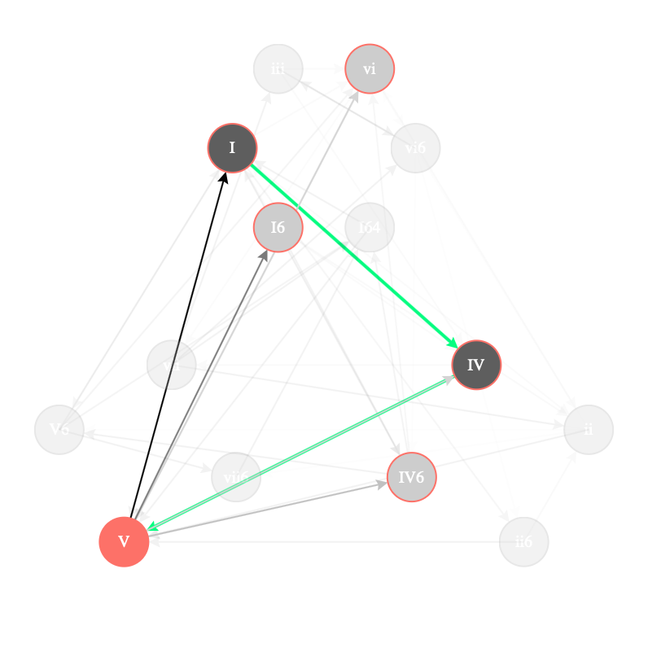
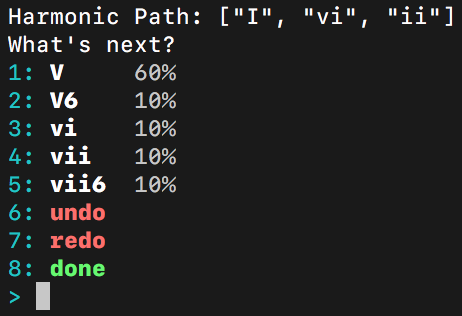

# Harmonic Network


[](https://travis-ci.org/jsbean/HarmonicNetwork)

Find your way through a network of harmony.

## Products

### Harmonic Network web app

Navigate to the Harmonic Network web app [here](https://harmonic-network.herokuapp.com).

Each node in this network represents a chord (expressed in a [roman numeral notation](https://en.wikipedia.org/wiki/Roman_numeral_analysis)). You can build up a chord progression by selecting one of the nodes connected to the currently highlighted one. You will start on the tonic (`I`) chord, and it's up to you to make some music from there.

The probability of going from any node to another is derived from the works of J.S. Bach (other composers coming soon!) and is represented by the darkness of the arrowed lines connecting them.




### Harmonic Network command line interface (CLI)

`HarmonicNetworkCLI` is a command line interface version of the web app shown above.



#### Usage

```Bash
swift build
./.build/debug/HarmonicNetworkCLI
```

Press the number corresponding to the chord to which you'd like to progress, to `undo` or `redo`, or to be `done` with the whole thing.

##### `--one-shot (-o)`

You can engage the `--one-shot` flag when you run the command line interface.

```Bash
./.build/debug/HarmonicNetworkCLI --one-shot
```

The `--one-shot` flag (`-o` for short) tells the program that you only want to create a single tonic progression. That is to say, as soon as you get to the tonic (`I`) chord again, the game's up.

If you don't call the `--one-shot` flag, you will choose new harmonies for the rest of eternity, or until you select the `done` option, your laptop battery runs out, or until the heat death of the universe. Your call.

## Contributing

### Requirements

In order to contribute to the development of the harmonic network applications, you'll need a few things:

- A Swift 5.0.x compiler (which you can get packaged up with Xcode 10.2 or 11-beta*, or from [here](https://swift.org/download/#releases))
- A Mac running Mojave (10.4.4) or later, or Linux machine running Ubuntu 14.04, 16.06, or 18.04

### Development

To start hacking away, clone this repository. You can copy and paste this into the `Terminal`.

```Bash
git clone https://github.com/jsbean/HarmonicNetwork && cd HarmonicNetwork
```

#### Targets

There are several targets in this Swift Package:

- `HarmonicNetworkCore` contains shared code used by the command line interface and the web app
- `HarmonicNetworkCLI` produces the executable for the command line interface
- `HarmonicNetworkWebApp` contains the code used to build the web app
- `HarmonicNetworkServer` produces the executable which serves the web app

To build and run the web app locally, build and run the server executable.

```Bash
swift run HarmonicNetworkServer
```

> You can do also do this in Xcode by selecting the `HarmonicNetworkServer` scheme and pressing the `▶` button.

You should see the following:

```
Server starting on http://localhost:8080
```

Then in your favorite web browser, navigate to `localhost:8080`.

## Inspiration

These tools are inspired by the [chord-sequence-chooser](https://github.com/bwetherfield/chord-sequence-chooser) by
[@bwetherfield](https://github.com/bwetherfield).
